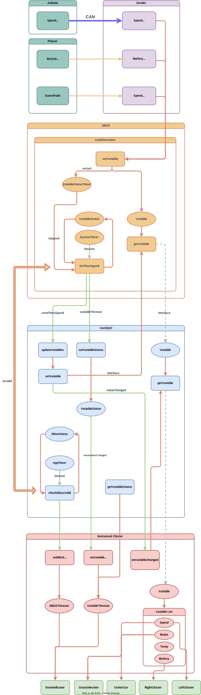

# **DES Project - Instrument Cluster**
PiRacer instrument cluster Qt application running on RPi and receiving speed data from a speed sensor via CAN  
 

## Project Intro

## Architecture

## Equipment

### Raspberry Pi 4B

- Raspberry Pi OS Lite 64bit (Linux 6.1 kernel)
- 2-Channel CAN-BUS(FD) Shield for Raspberry Pi (MCP2518FD)
- 7.9inch DSI LCD (400 x 1280, 60Hz)
- PiRacer AI Kit (PiRacer Standard)
- Joystick

### Arduino UNO

- CAN-BUS Shield V2.0 (MCP2515)
- Speed Sensor (LM393)

## Technology

- SSH (Secure Shell Protocol)
- I2C (Inter-Integrated Circuit)
- SPI (Serial Peripheral Interface)
- CAN bus communication (Controller Area Network)
- D-Bus as IPC (Inter Process Communication)

## Language

- C++
- Python3
- QML
- Arduino Sketch
- Shell Script

## Tool

- Qt Creator (with qmake)
- Qt Designer
- Arduino IDE
- Raspberry Pi Imager
- Visual Studio Code
- draw.io

---

## Table of Contents
### 0. [Presentation](./Documents/DES02.pdf)
### 1. [Hardware Settings](./Documents/HardwareSettings.md)
### 2. [Cross Compile](./Documents/CrossCompile.md)
### 3. [Display](./Documents/Display.md)
### 4. [Qt Creator Configuration](./Documents/QtCreatorConfiguration.md)
### 5. [CAN Communication with CAN-HAT](./Documents/CANCommunicationwithCAN-HAT.md)
### 6. [Get Sensor Data](./Documents/GetSenderData.md)
### 7. [Dbus](./Documents/Dbus.md)
### 8. [Connect CPP to QML](./Documents/ConnectCPPtoQML.md)
### 9. [GUI (QML)](./Documents/GUI(QML).md)
### 10. [Exception Handling](./Documents/ExceptionHandling.md)
